# Diagrama de Flujo General - MercadoLibre Scraper

## 📋 Descripción
Este diagrama muestra el flujo completo del programa desde la configuración inicial hasta la presentación de resultados.

## 🎯 Fases Principales
1. **Configuración**: Parámetros del usuario en Streamlit
2. **Scraping**: Extracción de productos de MercadoLibre  
3. **Comentarios**: Obtención de reviews por producto
4. **Análisis**: Procesamiento de sentimientos
5. **Resultados**: Visualización y descarga

## 📊 Diagrama

```mermaid
graph TD
    A[🚀 INICIO: Usuario ejecuta streamlit run] --> B[📱 Interfaz Streamlit se abre]
    B --> C{⚙️ Usuario configura parámetros}
    
    C --> D[📝 Término de búsqueda]
    C --> E[📄 Número de páginas 1-5]
    C --> F[💬 ¿Obtener comentarios?]
    C --> G[👥 Cantidad de productos]
    
    D --> H{🔍 ¿Todos los parámetros válidos?}
    E --> H
    F --> H
    G --> H
    
    H -->|❌ No| I[⚠️ Mostrar mensaje de error]
    I --> C
    
    H -->|✅ Sí| J[🎯 Usuario presiona 'Iniciar Scraping']
    J --> K[🔧 Crear instancia MercadoLibreScraper]
    
    K --> L[🌐 FASE 1: SCRAPING DE PRODUCTOS]
    L --> M[📊 Inicializar barra de progreso]
    M --> N[🔄 Loop: Para cada página 1 a max_pages]
    
    N --> O[🌍 Construir URL de MercadoLibre]
    O --> P[📡 Realizar petición HTTP con User-Agent aleatorio]
    P --> Q{📥 ¿Respuesta exitosa?}
    
    Q -->|❌ No| R[📝 Log error]
    R --> S{🔄 ¿Más páginas?}
    
    Q -->|✅ Sí| T[🔍 Extraer contenido HTML]
    T --> U[🎯 MÉTODO 1: Buscar JSON estructurado]
    U --> V{📋 ¿JSON encontrado?}
    
    V -->|✅ Sí| W[⚡ Procesar datos JSON]
    V -->|❌ No| X[🔧 MÉTODO 2: Regex HTML tradicional]
    
    W --> Y[📦 Agregar productos a lista]
    X --> Z[🔎 Extraer con patrones regex]
    Z --> Y
    
    Y --> AA[⏱️ Pausa 2-3 segundos]
    AA --> S
    
    S -->|✅ Sí| AB[➕ Incrementar página]
    AB --> N
    S -->|❌ No| AC{💬 ¿Extraer comentarios activado?}
    
    AC -->|❌ No| AD[📊 MOSTRAR RESULTADOS BÁSICOS]
    
    AC -->|✅ Sí| AE[🌐 FASE 2: SCRAPING DE COMENTARIOS]
    AE --> AF[🎯 Seleccionar primeros N productos]
    AF --> AG[🔄 Loop: Para cada producto seleccionado]
    
    AG --> AH[🌍 Acceder URL del producto]
    AH --> AI[📡 Realizar petición individual]
    AI --> AJ{📥 ¿Respuesta exitosa?}
    
    AJ -->|❌ No| AK[📝 Log error, continuar]
    AJ -->|✅ Sí| AL[🔍 Buscar bloques de comentarios]
    
    AL --> AM[📝 Extraer hasta 5 comentarios por producto]
    AM --> AN[⭐ Extraer puntuaciones originales]
    AN --> AO[💾 Guardar comentarios en producto]
    
    AO --> AP[⏱️ Pausa 2-3 segundos]
    AP --> AQ{🔄 ¿Más productos?}
    
    AQ -->|✅ Sí| AR[➕ Siguiente producto]
    AR --> AG
    AQ -->|❌ No| AS[🧠 FASE 3: ANÁLISIS DE SENTIMIENTOS]
    
    AK --> AQ
    
    AS --> AT[🔧 Crear instancia AnalizadorSentimiento]
    AT --> AU[🔄 Loop: Para cada producto con comentarios]
    
    AU --> AV[📝 Extraer comentarios del producto]
    AV --> AW[🔄 Loop: Para cada comentario individual]
    
    AW --> AX[🔡 NORMALIZAR TEXTO]
    AX --> AY[📝 Convertir a minúsculas]
    AY --> AZ[🔤 Eliminar acentos á→a, é→e, etc]
    AZ --> BA[🧹 Limpiar caracteres especiales]
    BA --> BB[✂️ Normalizar espacios múltiples]
    
    BB --> BC[🔪 TOKENIZACIÓN: Dividir en palabras]
    BC --> BD[🔄 Loop: Para cada palabra en comentario]
    
    BD --> BE[🔍 ANÁLISIS DE VENTANA DE CONTEXTO]
    BE --> BF[👀 Revisar 3 palabras anteriores]
    BF --> BG{🔍 ¿Hay multiplicador?}
    BG -->|✅ Sí| BH[📈 Aplicar factor 1.5x]
    BG -->|❌ No| BI[📊 Factor neutro 1.0x]
    
    BH --> BJ{🚫 ¿Hay negador?}
    BI --> BJ
    BJ -->|✅ Sí| BK[🔄 Aplicar factor -1.0x]
    BJ -->|❌ No| BL[➡️ Factor neutro 1.0x]
    
    BK --> BM{📖 ¿Palabra en diccionario?}
    BL --> BM
    
    BM -->|😊 Positiva| BN[➕ Sumar: +1.0 × multiplicador × negación]
    BM -->|😞 Negativa| BO[➖ Restar: -1.0 × multiplicador × negación]
    BM -->|😐 Neutral| BP[🚫 No afecta puntuación]
    
    BN --> BQ[📊 Incrementar contador palabras relevantes]
    BO --> BQ
    BP --> BR{🔄 ¿Más palabras?}
    BQ --> BR
    
    BR -->|✅ Sí| BS[➕ Siguiente palabra]
    BS --> BD
    BR -->|❌ No| BT[🧮 CALCULAR SENTIMIENTO]
    
    BT --> BU{📊 ¿Hay palabras relevantes?}
    BU -->|❌ No| BV[😐 Asignar sentimiento neutro 3.0]
    BU -->|✅ Sí| BW[📐 Calcular promedio: suma/cantidad]
    
    BW --> BX[🎯 Aplicar fórmula: 3.0 + promedio×2.0]
    BX --> BY[📏 Normalizar a rango 1.0-5.0]
    BY --> BZ[💾 Guardar sentimiento del comentario]
    
    BV --> BZ
    BZ --> CA{🔄 ¿Más comentarios del producto?}
    
    CA -->|✅ Sí| CB[➕ Siguiente comentario]
    CB --> AW
    CA -->|❌ No| CC[📊 Calcular promedio de sentimientos del producto]
    
    CC --> CD{🔄 ¿Más productos?}
    CD -->|✅ Sí| CE[➕ Siguiente producto]
    CE --> AU
    CD -->|❌ No| CF[📊 FASE 4: MOSTRAR RESULTADOS]
    
    CF --> CG[📋 Crear DataFrame con productos]
    CG --> CH[📈 Crear DataFrame con análisis sentimientos]
    CH --> CI[🎨 Mostrar interfaz con 3 pestañas]
    
    CI --> CJ[📊 TAB 1: Datos Extraídos]
    CI --> CK[🎯 TAB 2: Análisis Sentimientos]
    CI --> CL[📥 TAB 3: Descargas]
    
    CJ --> CM[📋 Mostrar tabla productos]
    CM --> CN[📊 Mostrar métricas básicas]
    
    CK --> CO[🏆 Mostrar Top 10 por sentimiento]
    CO --> CP[📈 Mostrar métricas sentimiento]
    CP --> CQ[📊 Mostrar tabla completa ordenada]
    
    CL --> CR[⬇️ Botón descarga CSV productos]
    CL --> CS[⬇️ Botón descarga CSV sentimientos]
    
    CN --> CT[💾 Guardar en session_state]
    CQ --> CT
    CR --> CT
    CS --> CT
    
    CT --> CU{🔄 ¿Usuario quiere nueva búsqueda?}
    CU -->|✅ Sí| CV[🗑️ Limpiar datos o nuevos parámetros]
    CV --> C
    CU -->|❌ No| CW[✅ FIN: Aplicación lista para uso]
    
    style A fill:#4CAF50,stroke:#2E7D32,stroke-width:3px,color:#fff
    style CW fill:#4CAF50,stroke:#2E7D32,stroke-width:3px,color:#fff
    style L fill:#2196F3,stroke:#1565C0,stroke-width:2px,color:#fff
    style AE fill:#FF9800,stroke:#F57C00,stroke-width:2px,color:#fff
    style AS fill:#9C27B0,stroke:#6A1B9A,stroke-width:2px,color:#fff
    style CF fill:#607D8B,stroke:#37474F,stroke-width:2px,color:#fff
```

## 🔗 Enlaces Relacionados
- [Algoritmo de Sentimientos](algoritmo-sentimientos.md)
- [Proceso de Análisis](proceso-analisis.md)
- [Documentación Técnica](../manual-tecnico.md)

## 📊 Métricas del Flujo
- **Fases principales**: 4
- **Puntos de decisión**: 12
- **Loops principales**: 4
- **Manejo de errores**: 3 puntos

## 🎯 Casos de Uso
1. **Desarrolladores**: Entender el flujo de ejecución
2. **QA Testing**: Identificar puntos de prueba
3. **Documentación**: Explicar el sistema a nuevos usuarios
4. **Debugging**: Localizar problemas en el flujo

---

## 👨‍💻 Autor
**Antonio Martinez** - [@alemeds](https://github.com/alemeds)  
📧 antonioLmartinez@gmail.com